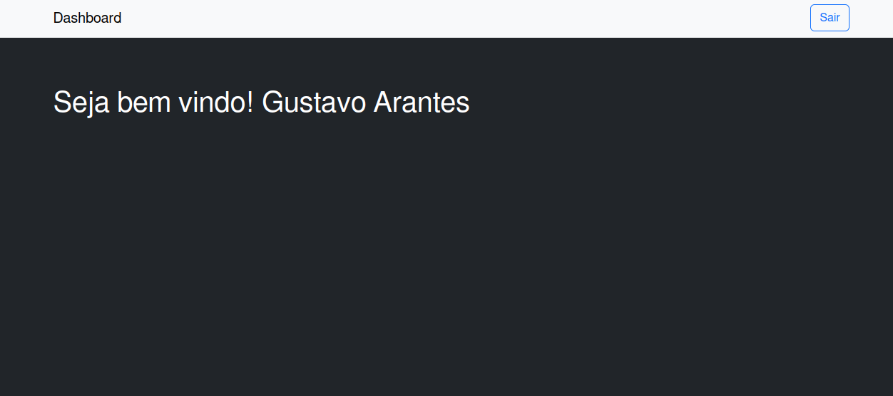

# Sistema de Login em PHP e Bootstrap.

## Introdução
Este é um projeto simples que desenvolvi a partir do zero para aplicar meus conhecimentos em PHP, Bootstrap e Docker.

Para o desenvolvimento deste projeto, utilizei Sessões do PHP para gerenciar erros e a lógica de acesso, alem disso usei o mysqli para executar as operações no banco de dados. Já no frontend utilizei o Bootstrap 5 para criar as interfaces.

Para configurar o ambiente de desenvolvimento, fiz o uso Docker com Docker Compose. Utilizei a imagem do Apache com PHP 8.2 e, para o banco de dados, utilizei a imagem do MariaDB. Também utilizei a imagem do PHPMyAdmin para auxiliar na administração do banco de dados.

## Funcionalidades do Sistema
O sistema inclui as seguintes funcionalidades:
- Login.
- Criação de conta.
- Recuperação de senha.
- Logout.

## Interfaces do Projeto

Tela de Login:

Tela de Cadastro:

Tela de Recuperar Senha:

Tela de Inicio:

## Tecnologias Utilizadas:
- Docker e Docker Compose
- Apache
- PHP 8.2
- Bootstrap 5
- MariaDB
- PHPMyAdmin